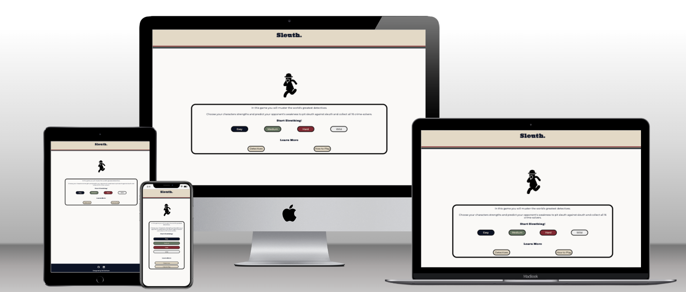
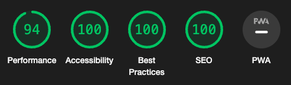
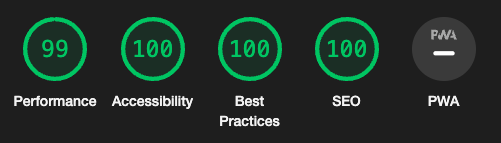

# Sleuth.

A Top Trumps style card game featuring the world’s greatest (fictional) detectives.

> So assemble your team and use your wits…the game is afoot!


Pit each sleuth against one another; use their strengths and weakness to gather all 16 cards and win. Featuring iconic crime-solvers such as Sherlock Holmes, Kinsey Millhone and Jonathan Creek, and 4 difficulty modes this game works across all devices.

So assemble your team and use your wits…the game is afoot!



[View deployed website here](https://denham-ed.github.io/sleuth/ "Link to open deployed website")

## User Stories

### Game Designer
As a developer and designer for this game, I want to create a simple, intuitive yet enjoyable game. The game should be immediately playable but scalable in the level of challenge to keep players returning to the game, even after successfully completing it. The level of complexity and challenge should match the length of time involved.

The game should be accessible on all devices so it can be played at home, in the office or on the go. It must also meet the requirements of WCAG standards to ensure that the game is open to all users. 

The design of the game should create an enjoyable response from the user but shouldn't impact the performance of the game.


### Game Player

As a user I want to experience an enjoyable, easy-to-learn game featuring favourite characters from the world of crime fiction. The game should be challenging enough to be enjoyable but simple to learn. Any prompts from the game should be clear and unabiguos but also add to the 'world of the game' in tone.


## Rules of the Game

1. Select a difficulty mode to start
2. When prompted, select an attribute for your detecive
    - If you have the highest number, you win your opponent's card and get to select an attribute for the next card. Both cards are placed at the bottom of your deck
    - If you have a lower number, your opponent wins your card and keeps their own. They then get to choose the next attribute
    - If there is a draw, the cards are placed in a separate pile and the player who selected the attribute chooses again for the next hand. The winner of the subsequent hands wins all the cards in the draw pile.
3. The game ends when one player has all 16 cards.


## Data Structure
The most important information for the game is the information for each detective. This is stored as an array of objections with the following structure - the example shown below is for Sherlock Homes

```
{
        name: "Sherlock Holmes",
        image: "assets/media/detectives/sherlock_holmes.jpeg",
        facts: [{
            stat: "Enemies",
            result: 4,
            relStrength: 1.01587301587302
        }, {
            stat: "Cases",
            result: 145,
            relStrength: 1.59889731219848
        }, {
            stat: "Style",
            result: 10,
            relStrength: 0.909090909090909
        }, {
            stat: "Assistants",
            result: 2,
            relStrength: 0.8
        }],
        biography: "Sherlock Holmes, the worlds first consulting detective, epitomises the fictional detective. Known for his powers of deduction and logical reasoning, first appeared in 1887. A century later there are over 25,000 stage adaptiions, films, television shows and publications featuring the occupant of 221B Baker Street",
        creator: "Arthur Conan Doyle"
    }
```

The result of each stat was randomly calculated between set ranges for this game. The relStrength (relative strength) shows the absolute deviation from the mean each stat across all the cards. This is used to decide which stat the opponent will select.

## Design

### Wireframes
### Fonts
Two fonts were used in the design of **Sleuth**; **Montserrat** and **Ultra**. Both are from [Google Fonts](https://fonts.google.com/).

**Montserrat** is used for the main body of the website, for information for the user and for prompts and declarations.

**Ultra** is used for headings (h1 & h2); its ultra-bold but clear style is perfect for providing semantic clarity and also double as logo-esque title in the header of the site.

### Colour
The design of **Sleuth** predominantly uses the colour palette, below.


The palette evokes a nostalgic 1970s theme; arguably the golden era of the TV detective with shows such as Hawaii Five-O, Charlie's Angels, Columbo, Kojak and more. It is also a nod the launch of the original Top Trumps card game in 1978.


### Artwork
The overall design of the cards is, naturally, inspired by the iconic Top Trump card design. 
For game play on smaller devices (max-width 905px) the card is rotated but all elements are maintained. For very small screens (max-width 400px) the card appears as a square but retains the artwork of the detective.

As the original images of detectives were varied widely in style, they are rendered in the game in a single stylised version. This was achieved using [Fotor](https://www.fotor.com/), a free image editing software, and approximates the hand-drawn style of the original Top Trumps cards

Blurred text is used on both the opponent card and draw-pile card to prevent the user from reading all the opponent card’s statistics, replicating the ‘in-person’ Top Trumps experience.


## Features

### Landing Page

### Detective Listing

### Difficulty Level

### Game Initiation

### Fact Selection and Comparison


### Draw Handling


### End Game Message

### Game Stats Modal


## Upcoming Features

### Change Speed of Game
A simple toggle in the header will allow the player to speed up and slow down the game play by setting a multiplier for the baseline interval for the messages during the card comparison phase of the game

### Hand Count
Players will be able to see how many rounds they have played. This will add another metric to measuring success in the game; how quickly can the player defeat their opponent.

### More Detectives
The code is designed to make the addition of further detectives easy - the listing page is rendered dynamically from the array of detectives and the assignment of cards will function as long as the total number of cards remains even.

## Testing & Performance
### Performance
Excellent scores were obtained via Lighthouse through Google Chrome DevTools.
- Mobile

- Desktop



### Validation Testing
**CSS**
- No errors were found when passing through the [official (Jigsaw) validator](https://jigsaw.w3.org/css-validator/validator?uri=https%3A%2F%2Fdenham-ed.github.io%2Fsleuth%2Findex.html&profile=css3svg&usermedium=all&warning=1&vextwarning=&lang=en)

**HTML**
- No errors were found when passing through the official (W3C) validtor for either:
    - [index.html](https://validator.w3.org/nu/?doc=https%3A%2F%2Fdenham-ed.github.io%2Fsleuth%2Findex.html) or
    - [detectives.html](https://validator.w3.org/nu/?doc=https%3A%2F%2Fdenham-ed.github.io%2Fsleuth%2Fdetectives.html)

Warnings were displayed to highlight missing headings in sections; I will consider this carefully for future projects.

**JavaScript**
- All JS scripts passed through [ESLint](https://eslint.org/play/) with no significant problems.
- The variable 'detectives' is flagged as undefined as the array is stored in a separate file but this is managed satisfactorily, without errors, in the program.

### User Testing

### Fixed Bugs
### Unfixed Bugs

**Consecutive Draws**
In the event of three consecutive draws, the draw-pile would effectively “overflow” causing the cards to spill over the central area used to convey messages to the user. However, with only sixteen cards and relatively narrow range of attributes, three consecutives draws is highly unlikely. It never occurred during testing or development, and I am satisfied that is currently acceptable edge-case.

If more cards, or more attributes with a narrower range of values, were added to the game, this would need to be re-evaluated. One potential solution would be to limit the displayed draw pile as 4 cards and add text (eg. “+ 2 cards”).


## Deployment

## Credits

### Content
- All content was written by the developer.
- Research for the detective's biographies was conducted via the relevant [Wikipedia](https://www.wikipedia.org/) pages.

### Media

### Code - THIS IS BAD FINISH,
- Code from users StackOverflow and w3schools is used occasionally throughtout this project. Credit and a link to the source can be found in the relevant js or css file.
- CSS Anima

### Acknowledgements
- The support of my mentor Spencer Barriball for his advice, guidance and directions to resources is gratefully acknowledged.
- The Code Institute example read me was used as a template for this document. This includes the instructions for deployment on GitHub Pages which are used in full, above.


###