# Sleuth.

A Top Trumps-style card game featuring the world’s greatest (fictional) detectives.

> So assemble your team and use your wits…the game is afoot!


Pit each sleuth against one another; use their strengths and weakness to gather all 16 cards and win. Featuring iconic crime-solvers such as Sherlock Holmes, Kinsey Millhone and Jonathan Creek, and 4 difficulty modes this game works across all devices.

So assemble your team and use your wits…the game is afoot!


[View deployed website here](https://denham-ed.github.io/sleuth/ "Link to open deployed website")

## User Stories

### Game Designer
As a developer and designer for this game, I want to create a simple, intuitive yet enjoyable game. The game should be immediately playable but scalable in the level of challenge to keep players returning to the game, even after successfully completing it. The level of complexity and challenge should match the length of time involved.

The game should be accessible on all devices so it can be played at home, in the office or on the go. It must also meet the requirements of WCAG standards to ensure that the game is open to all users. 

The design of the game should create an enjoyable response from the user but shouldn't impact the performance of the game.


### Game Player

As a user, I want to experience an enjoyable, easy-to-learn game featuring favourite characters from the world of crime fiction. The game should be challenging enough to be enjoyable but simple to learn. Any prompts from the game should be clear and unambiguous but also add to the 'world of the game' in tone.


## Rules of the Game

1. Select a difficulty mode to start
2. When prompted, select an attribute for your detective
    - If you have the highest number, you win your opponent's card and get to select an attribute for the next card. Both cards are placed at the bottom of your deck
    - If you have a lower number, your opponent wins your card and keeps their own. They then get to choose the next attribute
    - If there is a draw, the cards are placed in a separate pile and the player who selected the attribute chooses again for the next hand. The winner of the subsequent hands wins all the cards in the draw pile.
3. The game ends when one player has all 16 cards.


## Data Structure
The most important information for the game is the information for each detective. This is stored as an array of objections with the following structure - the example shown below is for Sherlock Homes

```
{
        name: "Sherlock Holmes",
        image: "assets/media/detectives/sherlock_holmes.jpeg",
        facts: [{
            stat: "Enemies",
            result: 4,
            relStrength: 1.01587301587302
        }, {
            stat: "Cases",
            result: 145,
            relStrength: 1.59889731219848
        }, {
            stat: "Style",
            result: 10,
            relStrength: 0.909090909090909
        }, {
            stat: "Assistants",
            result: 2,
            relStrength: 0.8
        }],
        biography: "Sherlock Holmes, the world's first consulting detective, epitomises the fictional detective. Known for his powers of deduction and logical reasoning, first appeared in 1887. A century later there are over 25,000 stage adaptations, films, television shows and publications featuring the occupant of 221B Baker Street",
        creator: "Arthur Conan Doyle"
    }
```

The result of each stat was randomly calculated between set ranges for this game. The relStrength (relative strength) shows the absolute deviation from the mean of each stat across all the cards. This is used to decide which stat the opponent will select.

## Design

### Wireframes
### Fonts
Two fonts were used in the design of **Sleuth**; **Montserrat** and **Ultra**. Both are from [Google Fonts](https://fonts.google.com/).

**Montserrat** is used for the main body of the website, for information for the user and for prompts and declarations.

**Ultra** is used for headings (h1 & h2); its ultra-bold but clear style is perfect for providing semantic clarity and also doubles as a logo-esque title in the header of the site.

### Colour
The design of **Sleuth** predominantly uses the colour palette, below.


The palette evokes a nostalgic 1970s theme; arguably the golden era of the TV detective with shows such as Hawaii Five-O, Charlie's Angels, Columbo, Kojak and more. It is also a nod to the launch of the original Top Trumps card game in 1978.


### Artwork
The overall design of the cards is, naturally, inspired by the iconic Top Trump card design. 
For gameplay on smaller devices (max-width 905px) the card is rotated but all elements are maintained. For very small screens (max-width 400px) the card appears as a square but retains the artwork of the detective.

As the original images of detectives varied widely in style, they are rendered in the game in a single stylised version. This was achieved using [Fotor](https://www.fotor.com/), a free image editing software, and approximates the hand-drawn style of the original Top Trumps cards

Blurred text is used on both the opponent card and draw-pile card to prevent the user from reading all the opponent card’s statistics, replicating the ‘in-person’ Top Trumps experience.

## Features

### Landing Page

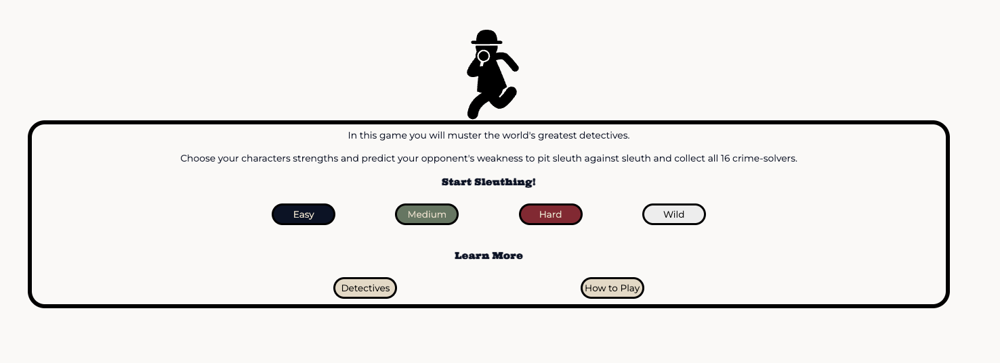

The landing page guides the user to either:
1. Initiate a new game by selecting the difficulty level 
    OR
2. Learn more about the game by clicking the How to Play or Detectives button

### Header


The header shows the logo and main font throughout, as well as the blue, green and red stripes in a go-faster-racing style. Buttons that provide more information to the user appear here, such as the button to open the Game Stats modal.

### Footer


The footer sits at the bottom of the page. It contains two links:
1. To the project's GitHub repository
2. To the developer's LinkedIn profile

### How to Play
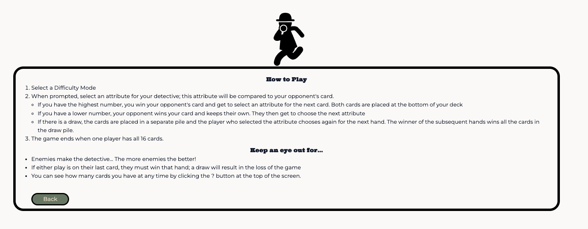

The 'How to Play' instructions are rendered inside the same central messaging area without navigating to another page. Users can use the green Back button to refresh the page and see the buttons to initiate a new game

### Detective Listing
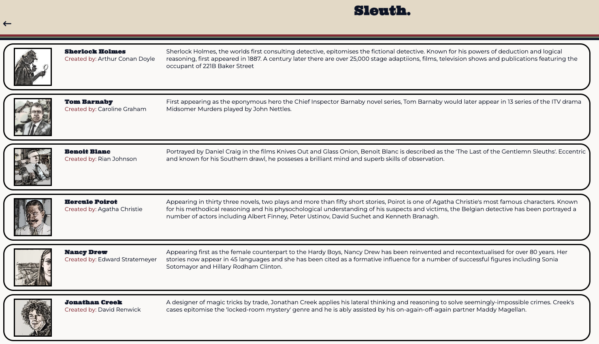

The listing is rendered dynamically and provides a snapshot of the image, name and biography of each detective featured in the game. It also credits the creator of each protagonist.

### Difficulty Level
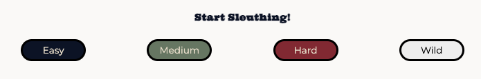

The user can vary the difficulty level by clicking on the buttons in this section. The level sets the spread of probability that the opponent will choose their strongest attribute; on Easy, the opponent will often choose their weakest value, whereas on Hard they will consistently choose their best option.

The user's choice is added to the DOM (in the Game Stats modal), where it can be retrieved.

Choosing a difficulty level initiates a new game.

### Game Initiation
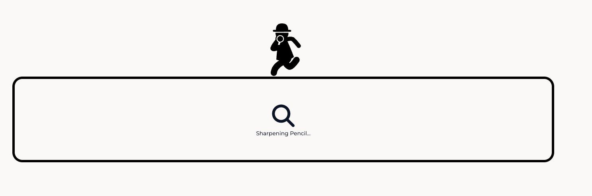

After initiation, a series of tantalising messages are displayed to the user to create a 'loading' effect. This builds anticipation and helps to establish the language and world of the game.

### Main Game Phase
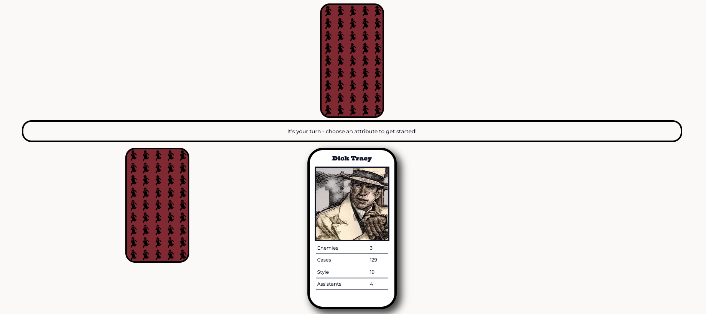

In the main phase of the game, the user's card is rendered with an image, name and attributes. The opponent's card is shown face down. For large devices, the player's deck will also be displayed. A prompt to the user (indicating whether it is their turn or not) is displayed in the central section.

### Player Deck
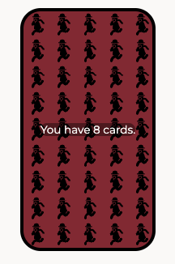

Hovering over the player's deck will show how many cards they have in total.

### Attribute Selection
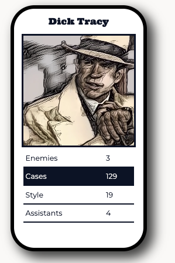

When the user selects an attribute, it is highlighted and the other options are locked to prevent the comparison from being fired multiple times.

### Opponent Card
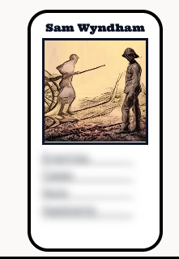

After an attribute has been chosen, either by the user or the opponent, the opponent's card is revealed; the image and name are shown but the attributes are blurred to prevent the user from gaining an unfair advantage.

### Draw Handling
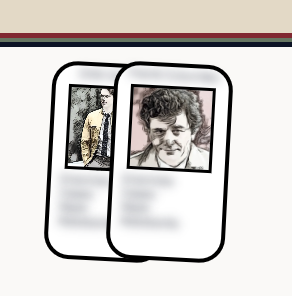

In the event of a draw, the two cards are put to one side; on large devices, this is rendered as a face-up draw pile, with the image clear but the name and attributes blurred.

The pile is removed once a hand is won.

### Game Stats Modal
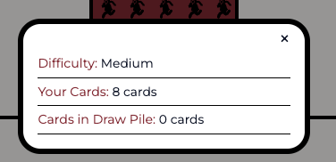

The user can view the stats of the game (Difficulty, Number of Cards in Hand, Number of Cards in Draw Pile) at any time by opening the Game Stats Modal. The modal appears over the rest of the game area and can be exited by clicking the 'x' or anywhere outside of the modal.

### Last Card Warning


If either the player or opponent has just a single card remaining, a red flashing warning will appear to the user. It is removed if the player with a card manages to win the next hand.

### End Game Message - Win
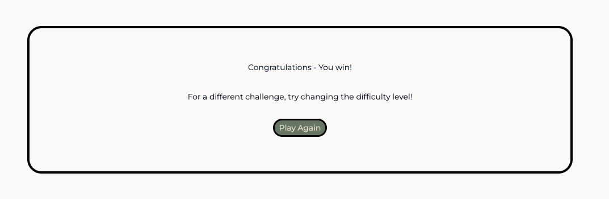

If the player wins (collects all 16 cards), all the remaining cards are cleared and a congratulatory message appears in the central message area. The player is invited to try the game again at a different difficulty setting.

The Play Again button refreshes the page, taking the user back to the landing page.

### End Game Message - Loss
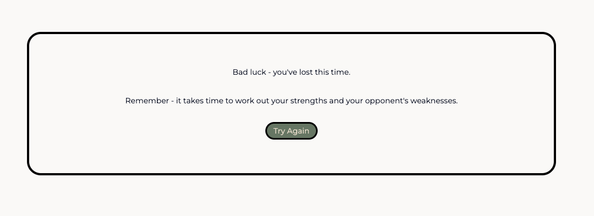


If the player loses all of their cards, all the remaining cards are cleared and a conciliatory message appears. It invites the player to try again; the Try Again button refreshes the page, taking the user back to the landing page.

## Upcoming Features

### Change the Speed of the Game
A simple toggle in the header will allow the player to speed up and slow down the gameplay by setting a multiplier for the baseline interval for the messages during the card comparison phase of the game

### Hand Count
Players will be able to see how many rounds they have played. This will add another metric to measuring success in the game; how quickly can the player defeat their opponent.

### More Detectives
The code is designed to make the addition of further detectives easy - the listing page is rendered dynamically from the array of detectives and the assignment of cards will function as long as the total number of cards remains even.

## Testing & Performance
### Performance
Excellent scores were obtained via Lighthouse through Google Chrome DevTools.
- Mobile


- Desktop


### Responsiveness Testing

Sleuth is built with responsive design in mind and has been thoroughly tested using [Responsive Design Checker](https://responsivedesignchecker.com/) and the DevTools in Google Chrome.

As the screenshots below demonstrate it works flexibly and efficiently on screens ranging from 1920x1200px to 320x480px. On Chrome, it has also been tested successfully down to a width of 280px.

**Large Display**


**Medium Display (iPads, tablets etc)**


**Small Display**


### Validation Testing
**CSS**
- No errors were found when passing through the [official (Jigsaw) validator](https://jigsaw.w3.org/css-validator/validator?uri=https%3A%2F%2Fdenham-ed.github.io%2Fsleuth%2Findex.html&profile=css3svg&usermedium=all&warning=1&vextwarning=&lang=en)

**HTML**
- No errors were found when passing through the official (W3C) validator for either:
    - [index.html](https://validator.w3.org/nu/?doc=https%3A%2F%2Fdenham-ed.github.io%2Fsleuth%2Findex.html) or
    - [detectives.html](https://validator.w3.org/nu/?doc=https%3A%2F%2Fdenham-ed.github.io%2Fsleuth%2Fdetectives.html)

Warnings were displayed to highlight missing headings in sections; I will consider this carefully for future projects.

**JavaScript**
- All JS scripts passed through [ESLint](https://eslint.org/play/) with no significant problems.
- The variable 'detectives' is flagged as undefined as the array is stored in a separate file but this is managed satisfactorily, without errors, in the program.

### User Testing

**Pre-Game - Landing, Instruction and Detectives Listing Pages**

| **User Action** | **Expected Result** | **Pass / Fail** |
|---|---|---|
| Enter URL into browser address bar | User is taken to Landing Page with buttons for initiating new game | Pass |
| Click on the title in the header (Sleuth.) | Navigates to the landing page | Pass |
| Click on Detectives button | Navigates to Detectives Listing page | Pass |
| Click on Arrow button in header | Navigates back to Landing Page | Pass |
| Click on How to Play button | Renders instructions to central messaging area  | Pass |
| Click on Difficulty (Easy, Medium, Hard & Wild) buttons | Game initiates; game container is prepared, logo is removed; difficulty level is rendered into the game stats modal | Pass |
| Click on GitHub logo in footer | Opens new tab displaying the Sleuth repository on GitHub | Pass |
| Click on LinkedIn logo in footer | Opens new tab displaying the developer's LinkedIn profile | Pass |


**Main Game Phase**

| **User Action** | **Expected Result** | **Pass / Fail** |
|---|---|---|
| User hover's mouse over detective attributes | Text turns red | Pass |
| User selects attribute with mouse click | Attribute turn's blue and triggers comparison | Pass |
| _Proceeds from above action_ | User can no longer click on attributes | Pass |
| _Proceeds from above action_ | Opponent's card (image and title) is revealed | Pass |
| _Proceeds from above action_ | Attributes are compared and an appropriate message is rendered in the message area | Pass |
| _Proceeds from above action_ | Player and opponent decks are updated | Pass |
| _Proceeds from above action_ | Player's next card is revealed | Pass |
| _Proceeds from above action_ | Opponent's card is shown face down | Pass |
| _Proceeds from above action_ | Game Stats Modal is updated | Pass |
| _Proceeds from above action_ | Text on Player Deck is updated | Pass |

**Game Stats Modal**

| **User Action** | **Expected Result** | **Pass / Fail** |
|---|---|---|
| Player clicks on ? button in header | Opens Game Stats Modal with current scores | Pass |
| Player clicks outside of modal | Game Stats Modal closes | Pass |
| Player clicks on 'x' in modal | Gam Stats Modal closes | Pass |

**Large (>905px) Devices Only**

| **User Action** | **Expected Result** | **Pass / Fail** |
|---|---|---|
| User hovers over player deck | Displays current number of cards | Pass |
| User triggers draw | Draw pile is rendered with name and stats obscured | Pass |
| User wins or loses after draw | Draw pile is cleared from screen | Pass |
| User has 1 card | Last card warning appears in user area | Pass |
| User takes all but 1 cards | Last card warning appears in opponent area | Pass |
| Both players have at least 2 cards | No warning are present | Pass |

**Game End**

| **User Action** | **Expected Result** | **Pass / Fail** |
|---|---|---|
| Player has 0 cards remaining | Game container is cleared of ephemera and user loss message is displayed | Pass |
| User clicks 'Try Again' button | Navigates to Landing Page | Pass |
| Player has all cards | Game container is cleared of ephemera and user win message is displayed | Pass |
| User clicks 'Play Again' button | Navigates to Landing Page | Pass |

### Unfixed Bugs

**Consecutive Draws**
In the event of three consecutive draws, the draw-pile would effectively “overflow” causing the cards to spill over the central area used to convey messages to the user. However, with only sixteen cards and a relatively narrow range of attributes, three consecutive draws are highly unlikely. It never occurred during testing or development, and I am satisfied that is currently an acceptable edge case.

If more cards, or more attributes with a narrower range of values, were added to the game, this would need to be re-evaluated. One potential solution would be to limit the displayed draw pile to 4 cards and add text (eg. “+ 2 cards”).

## Deployment

Git and GitHub were used throughout this project to assist with version control and deployment. 

The following steps were followed:

1. A new Git repository was created using *git init*
2. Changes were added regularly using *git add .*
3. Changes were commited using *git commit -m* with a clear, imperative message to describe the change
4. Finally the local repository was uploaded to a remote repository (this one) using the command *git push*


The site was deployed to GitHub pages. The steps to deploy are as follows:

- In the GitHub repository, navigate to the Settings tab
- From the source section drop-down menu, select the Master Branch
- Once the master branch has been selected, the page will be automatically refreshed with a detailed ribbon display to indicate the successful deployment.

The live link can be found here: https://denham-ed.github.io/sleuth

## Create a Local Copy
To create a local copy of this project:
1. Create a folder where you want the cloned directory to be stored
2. Open your terminal and navigate to this new directory
3. In the terminal, run git clone https://github.com/denham-ed/sleuth.git

## Credits

### General
- The original game idea and mechanics are based upon the highly successful [Top Trumps series](https://toptrumps.com/home/)
- The detectives are all characters whose creators are recognised in the Detectives Listing page.

### Content
- All content was written by the developer.
- Research for the detective's biographies was conducted via the relevant [Wikipedia](https://www.wikipedia.org/) pages.

### Design

- The design of the cards is inspired by the original Top Trumps series
- The images of detectives are highly-stylised versions of images found through Google Images. Copyright of these images would need further investigation for any commercial purpose.
- The magnifying glass, detective icon and left arrow are from [Font Awesome](https://fontawesome.com/)

### Code
The following resources were used or adapted in this project. All sources are also credited as they appear in the source code.

- [How to Randomize A Javascript Array](https://tinyurl.com/mr5vhup5): used to shuffle the initial array and game initiation.
- [Box Shadow Generator](https://tinyurl.com/35rmd9s2): helped with the initial design of the shadow under the player card
- [How to Create Blurry Text in CSS](https://tinyurl.com/yuprww3x): used to blur the attributes and names on non-player cards
- [Make Flex Items Overlap](https://tinyurl.com/56m756s3): used in the draw pile for large devices
- [How to Create a CSS / JS Modal](https://tinyurl.com/mpz8ctmt): used for the game stats modal
- [CSS Animations Generator](https://tinyurl.com/bdf87sak): assisted with the code for the revolving image in the version for small devices.
- [Favicon Generator](https://favicon.io/favicon-generator/): used to design and generate the favicon and manifest


### Acknowledgements
- The support of my mentor Spencer Barriball for his advice, guidance and directions to resources is gratefully acknowledged.
- The Code Institute example read me was used as a template for this document. This includes the instructions for deployment on GitHub Pages which are used in full, above.
